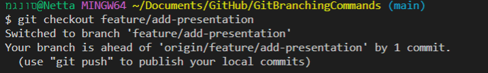
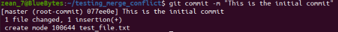
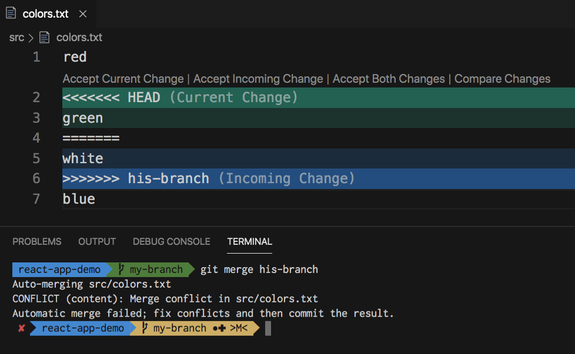
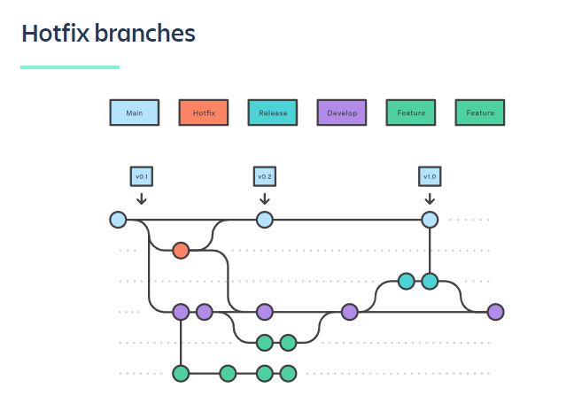

<!-- _class: invert -->
# Git branching commands
Nomi Magnus

---
<!-- backgroundColor: #f3c7bf -->
<!-- header: Git Rebase -->

```bash
git rebase
```

---
#### Use-Cases:
   - **Rebasing Feature Branches**: When you want to incorporate changes from the main branch into your feature branch while maintaining a cleaner commit history.
   - **Interactive Rebasing**: Rewriting commit messages, squashing commits, reordering commits, and resolving conflicts during the rebase process.
   - **Collaborative Work**: Rebase can be used to keep your local branch up to date with the remote main branch before pushing your changes.

---

#### Pros:
   -  Offers a cleaner commit history by avoiding unnecessary merge commits.
   - Helps in resolving conflicts before finalizing the changes.
   - Allows for interactive rebase to amend commits and maintain a more organized history.

---

#### Cons:
   - **Modified History**: Rebasing changes the commit history, which can make collaboration with others challenging if not done correctly.
   - **Risk of Losing Commits**: There is a risk of losing changes if the rebase process is not handled properly.

---

#### Coding Example:
```bash
    # Start a rebase on the current branch to the main branch
    git checkout feature-branch
    git rebase main

    # Resolve any conflicts if they occur
    # Continue the rebase if conflicts are resolved
    git rebase --continue

    # Stop the rebase process if needed
    git rebase --abort
```
---

#### Alternatives:
   - **Merge**: Using `git merge` instead of `git rebase` to combine changes from one branch to another.

---
#### Screenshots:
       

---
<!-- backgroundColor: #f5dca6 -->
<!-- header: Git Checkout -->

```bash
git checkout
```

---
#### Use-Cases:
- **Switch Branches**: The primary use of `git checkout` is to switch between branches in a Git repository.
- **Create New Branch**: You can create a new branch and switch to it using `git checkout -b new-branch`.
- **Discard Changes**: It can be used to discard changes in a file or revert to a previous commit.
- **Create Detached HEAD**: Useful for reviewing historical commits or working on a specific commit without creating a new branch.

---
#### Pros:
- **Branch Navigation**: Easily switch between branches to work on different features or fixes.
- **Quick Changes**: Quickly discard changes or revert to a specific commit in the working directory.

---
#### Cons:
- **Confusion with Detached HEAD**: Users may accidentally end up in a detached HEAD state, where changes are not part of any branch.
- **Potential Loss of Uncommitted Changes**: Using `git checkout` to switch branches can overwrite uncommitted changes.

---
#### Coding Example:
```bash
# Switch to an existing branch
git checkout branch-name

# Create and switch to a new branch
git checkout -b new-branch

# Discard changes in a file
git checkout -- file.txt

# Revert to a specific commit (create detached HEAD)
git checkout commit-hash
```

<p style="background-color:red">Remember to handle Git commands with caution, especially when switching branches or discarding changes to avoid data loss or accidental mistakes!</p>

---
#### Alternatives:
- ``git switch``: A newer command introduced for safer branch switching that enforces a strict rule of not overriding uncommitted changes.
- ``git restore``: An alternative for discarding changes or reverting files in Git.
- ``git reset``: Used for resetting changes in the staging index or working directory.

---
#### Screenshots:


---
<!-- backgroundColor: #ede4ab -->
<!-- header: Git Commit -->

```bash
git commit
```

---

#### Use-Cases:
- **Tracking Changes**: Git commit is used to save changes to the local repository and create a new commit.
- **Granular History**: Helps in tracking changes made to files and provides a detailed history of the project.
- **Atomic Commits**: Allows for committing changes in a logical and atomic manner, which aids in reviewing the project history.

---
#### Pros:
- **Version Control**: Helps in maintaining a history of changes and versions of the project.
- **Code Review**: Facilitates code review by providing a detailed log of changes.
- **Undo Changes**: Enables reverting to previous states by using historical commits.

---
#### Cons:
- **Accidental Commits**: Users may accidentally commit unintended changes if not careful.
- **Large Commits**: Creating large commits can make it harder to track changes and understand the project's history.

---
#### Coding Example:
```bash
# Add changes to the staging area
git add file.txt

# Commit changes with a message
git commit -m "Add new feature"

# Amend the last commit (if needed)
git commit --amend
```
<p style="background-color:red">
Remember to provide clear and meaningful commit messages to enhance code understanding and collaboration!<p>

---
#### Alternatives:
- **git stash**: Temporarily store changes without committing them, useful for switching branches.
- **Interactive Rebase**: Squash or split commits during a rebase process for a cleaner commit history.

---
#### Screenshots:


---
<!-- backgroundColor: #c5edab -->
<!-- header: Git Merge -->
```bash
git merge
```

---
#### Use-Cases:
- **Branch Integration**: Merge is used to integrate changes from one branch into another, typically bringing the changes from a feature branch into the main branch.
- **Collaboration**: Allows team members to combine their work on a shared branch, consolidating changes made by multiple developers.
- **Feature Deployment**: Merging feature branches into the main branch for deployment after successful testing.

---
#### Pros:
- **Simple Integration**: Provides a straightforward way to combine changes from different branches.
- **Preserves History**: Maintains a history of merged branches, showing the progression of work.
- **Fast Track Integration**: Useful for quickly integrating changes without complex rebasing.

---
#### Cons:
- **Merge Commits**: Generates merge commits in the commit history, which may clutter the history if not managed properly.
- **Potential Conflicts**: Can lead to conflicts when merging branches with conflicting changes.
- **Linear History**: May result in a non-linear commit history if multiple branches are merged without rebase.

---
#### Coding Example:
```bash
# Switch to the branch you want to merge changes into
git checkout main

# Merge changes from the feature branch into the main branch
git merge feature-branch
```
<p style="background-color:red">
Remember to resolve any merge conflicts that may arise and commit the changes after a successful merge to keep the project history clean!</p>

---
#### Alternatives:
- **Rebase**: Instead of merging, you can rebase changes from one branch onto another to maintain a cleaner commit history.
- **Merge Squash**: Combine changes from a feature branch into a single commit before merging into the main branch.

---
#### Screenshots:


---
<!-- backgroundColor: #86eff3 -->
<!-- header: Git Merge --squash -->
```bash
git merge --squash
```

---
#### Use-Cases:
- **Feature Branch Integration**: Useful when integrating changes from a feature branch into the main branch while condensing multiple commits into a single commit.
- **Streamlining History**: Helps in maintaining a clean and concise commit history by squashing multiple feature commits into a single commit.
- **Pull Request Enhancement**: Improves the readability of pull requests by presenting changes as a single atomic unit.

---
#### Pros:
- **Clean History**: Provides a cleaner and simplified commit history by merging feature changes into a single commit.
- **Easier Review**: Simplifies code review process by presenting feature changes as a single coherent unit.
- **Atomic Commits**: Offers the ability to present related changes as a single atomic commit.

---
#### Cons:
- **Lost Granularity**: Once squashed, the individual commits from the feature branch are no longer visible in the main branch's history.
- **Potential Data Loss**: Care must be taken to ensure that important information from the squashed commits is not lost during the process.

---
#### Coding Example:
```bash
# Checkout the main branch
git checkout main

# Merge the feature branch into the main branch with squash
git merge --squash feature-branch

# Commit the squashed changes
git commit -m "Add new feature with enhancements"
```
<p style="background-color:red">Ensure the squashing of commits aligns with your team's Git workflow and code review practices!</p>

---
#### Alternatives:
- **Interactive Rebase**: Achieve a similar outcome by interactively rebasing the feature branch onto the main branch and squashing commits during the rebase process.
- **Regular Merge**: Performing a regular merge without using the `--squash` option to maintain the individual commit history.

---
#### Screenshots:


---
<!-- backgroundColor: #aef1ee -->
<!-- header: Git Reset-->

```bash
git reset
```

---

#### Use-Cases:
- **Undo Commits**: Use `git reset` to undo commits, either by moving the HEAD to a previous commit or resetting the staging area.
- **Unstage Changes**: Resetting changes from the staging area back to the working directory without modifying the commit history.
- **Mixed Resets**: Resetting the staging area and working directory, but keeping the changes in the working directory.

---
#### Pros:
- **Flexible Undo**: Provides flexibility in undoing changes at different levels (soft, mixed, hard) depending on the need.
- **Selective Staging**: Allows for selective staging of changes from the working directory without affecting the commit history.
- **Local Operations**: Operations with `git reset` are local and do not affect the remote repository until push.

---
#### Cons:
- **Potential Data Loss**: There is a risk of losing changes if not used carefully, especially with a hard reset.
- **Commit History Alteration**: Resetting can alter the commit history, which may impact collaboration if pushed changes are reset.
- **Confusing History**: If misused, resetting can lead to a confusing commit history.

---
#### Coding Example:
```bash
# Undo the most recent commit,
#   moving changes to the working directory
git reset HEAD~

# Unstage changes from the staging area, 
#   keeping them in the working directory
git reset --mixed

# Discard all changes,
#   resetting both staging area and working directory
git reset --hard
```
<p style="background:red">Remember to use `git reset` with caution, especially when altering commit history, to avoid unintentional data loss or confusion in the project history!</p>

---
#### Alternatives:
- **git revert**: Instead of resetting, `git revert` creates a new commit that undoes the changes introduced by a specific commit, preserving the commit history.
- **Stashing**: Temporarily store changes with `git stash` if you want to save them outside the commit history temporarily.
- **Interactive Rebase**: Use interactive rebase to modify commit history while maintaining a clean and organized commit log.

---
#### Screenshots:


---
<!-- backgroundColor: #75f3ec -->
<!-- header: Multiple upstreams in Git -->

### Multiple upstreams in Git

---

### Use-Cases:
- **Collaboration**: When working on a forked repository and need to track multiple upstream repositories for fetching changes.
- **Feature Branches**: Managing multiple feature branches with different upstream repositories where changes need to be pulled from.
- **Advanced Workflows**: Setting up multiple upstreams can be beneficial in complex projects with various dependencies.

---
### Pros:
- **Enhanced Flexibility**: Allows fetching changes from multiple remote repositories easily.
- **Efficient Collaboration**: Facilitates collaboration when working with different teams or repositories.
- **Diverse Workflows**: Supports diverse development workflows and branching strategies.

---
### Cons:
- **Confusion**: Managing multiple upstreams can lead to confusion if not handled carefully.
- **Conflict Resolution**: Possibility of conflicts arising from changes fetched from different upstream repositories.
- **Complexity**: Increases the complexity of the Git configuration, especially for beginners.

---
### Coding Example:
```bash
# Add multiple upstream repositories
git remote add upstream1 <URL>
git remote add upstream2 <URL>

# Fetch changes from specific upstream
git fetch upstream1

# List all your branches and branch tracking
git branch -vv
```

---
### Alternatives:
- **Branching Strategies**: Instead of setting multiple upstreams, consider branching strategies like feature branches or development branches to manage changes.
- **Fork Workflow**: Utilize a fork workflow where changes are managed by forking a repository and collaborating through pull requests.

---
### Screenshots:


---
<!-- backgroundColor: #80f3ce -->
<!-- header: Merge Conflicts and Resolution in Git -->

### Merge Conflicts and Resolution in Git

---

#### Use-Cases:
- **Parallel Development**: Merge conflicts occur when two branches have diverged and changes are made to the same part of a file in both branches.
- **Collaboration**: Common in team workflows when multiple developers are working on the same codebase and need to merge changes.
- **Complex Merges**: More prevalent in complex projects with numerous branches and frequent changes merging.

---
#### Pros:
- **Clarity**: Merge conflicts prompt developers to review and resolve conflicting changes, ensuring code quality.
- **Control**: Provides developers with the ability to decide which changes to keep or discard during conflict resolution.
- **Collaborative**: Facilitates collaboration and communication within the team to resolve conflicting changes.

---
#### Cons:
- **Time-Consuming**: Resolving merge conflicts can be time-consuming, particularly in large projects with extensive conflicts.
- **Potential Errors**: Incorrect conflict resolution can introduce bugs or break functionality in the codebase.
- **Disruption**: Conflicts can disrupt the flow of development if not managed efficiently.

---
#### Coding Example:
```bash
# Create a merge conflict intentionally
# (Assuming conflicting changes in the same file)
git checkout main
git pull
git checkout -b feature-branch
# Make changes to the same file, then attempt to merge
# It's nice to add an emoji in the beginig of the commit.
git add .
git commit -m "✨ Commit on feature-branch"
git checkout main
git merge feature-branch
```
<p style="background:red">
Remember to follow best practices in resolving merge conflicts, communicate effectively with teammates, and thoroughly test the code after conflict resolution!</p>

---
#### Alternatives:
- **Rebase**: Instead of merging, rebase one branch onto another, potentially avoiding conflicts by applying changes one at a time.
- **Interactive Rebase**: Allows for editing, squashing, or dropping commits during the rebase process, reducing merge conflicts.

---
#### Screenshots:


---




---
<!-- backgroundColor: #bef5e4 -->
<!-- header: Git's Branch System -->

### Git's Branch System

---

#### Use-Cases:
- **Feature Development**: Branches are used to isolate work on a specific feature or bug fix without affecting the main codebase.
- **Parallel Development**: Enables multiple team members to work on different features simultaneously in separate branches.
- **Hotfixes**: Branches are handy for quickly creating and deploying hotfixes to production without disturbing ongoing feature work.

---


---

#### Pros:
- **Isolation**: Branches provide a sandboxed environment for developing new features or fixing issues without impacting the main branch.
- **Parallelization**: Supports parallel development, allowing team members to work on different tasks concurrently.
- **Feature Staging**: Branches facilitate staging features independently before merging them into the main codebase.

---
#### Cons:
- **Merge Conflicts**: Merging branches can lead to conflicts that need to be resolved carefully.
- **Branch Proliferation**: Over time, too many branches can clutter the repository and make it harder to manage.
- **Branch Drift**: Branches diverging significantly from the main branch may cause integration challenges during merging.

---
#### Coding Example:
```bash
# Create a new branch
git checkout -b feature-branch

# Make changes, add commits
git add .
git commit -m "Add new feature"

# Switch back to the main branch
git checkout main

# Merge the feature branch into the main branch
git merge feature-branch
```
---
#### Alternatives:
- **Git Flow**: A branching model that defines a strict branching strategy with specific branch names and their purposes.
- **GitHub Flow**: Simplified workflow where all changes are made directly to main branch through pull requests.

---
#### Screenshots:
See details of all branches:


---
<!-- backgroundColor: #7AC0FF -->

# End ...

---
### Resources
- github community
- git tutorials
- https://www.atlassian.com/
- https://marketplace.visualstudio.com/
- Medium
